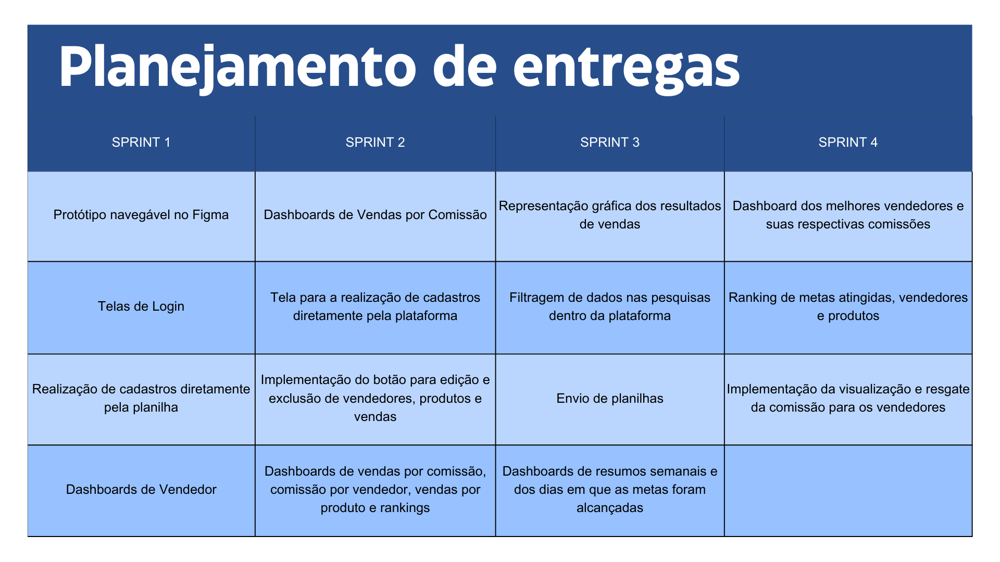

# 🎯 Projeto

 O desafio do terceiro semestre consiste no desenvolvimento de uma  Dashboard de Comissões de Vendas, para uma empresa que receba dados de vendas e apresente as informações de comissões de vendas dos vendedores. O sistema deve ser capaz de calcular e exibir as comissões com base em diferentes tipos de vendas, tais como: 

- Produto novo para novo cliente 

- Produto antigo para cliente novo 

- Produto novo para cliente antigo 

- Produto antigo para cliente antigo 

- Cada tipo de venda estará associado a um plano de remuneração específico, que poderá ser configurado para determinar o bônus a ser atribuído a cada vendedor. 

 Este desafio proposto pela disciplina de Estrutura de Dados e Engenharia de Software na Fatec São José dos Campos, visa levantar e registrar requisitos usando técnicas de métodos ágeis e tradicionais, documentar adequadamente DoR e DoD, modelar processos de negócio usando técnicas VPC e BPMN, planejar desenvolvimento de software (Backlog de Produto e Backlog de Sprint), projetar arquitetura lógica de software, implementar aplicação usando conceitos de orientação a objetos (ORM), utilizar IDE´s na implementação de aplicação em Typescript

# ➯ Cronograma

 

## 👨‍💻 Equipe

  
|Nome|Função|GitHub|Linkedin|
| -------- |-------- |-------- |-------- |
|**Bruno Silvério**|Scrum Master|[@GitHub](https://github.com/BrunoVieira30)|[@Linkedin](https://www.linkedin.com/in/bruno-vieira-b999a2224/)
|**Cauã Dezidera**|Product Owner|[@GitHub](https://github.com/CauaDezidera)|[@Linkedin](https://www.linkedin.com/in/cauã-dezidera-375736275/) 
|**Mateus Madeira**|Desenvolvedor|[@GitHub](https://github.com/mafemad)|[@Linkedin](https://www.linkedin.com/in/mateus-ferreira-madeira)
|**Pedro Kajiya**|Desenvolvedor|[@GitHub](https://github.com/kajiyap)|[@Linkedin](https://www.linkedin.com/in/pedro-santos-kajiya-65763b260/)
|**Abner Machado**|Desenvolvedor|[@GitHub](https://github.com/abnerdouglas)|[@Linkedin](https://www.linkedin.com/in/abner-douglas-a70a9b199/)
|**Enzo Pereira**|Desenvolvedor|[@Github](https://github.com/Enzopereira01) | [@Linkedin](https://www.linkedin.com/in/enzo-pereira-13331b272/)
|**Erick Hideki**|Desenvolvedor|[@GitHub](https://github.com/erickhoawata)|[@Linkedin](http://linkedin.com/in/érick-awata)
|**Maria Eduarda Leite**|Desenvolvedor|[@GitHub](https://github.com/Dudaleite08)|[@Linkedin]()
|**Ryan Seiji Wakugawa**|Desenvolvedor|[@GitHub](https://github.com/ryan-wakugawa)|[@Linkedin](https://www.linkedin.com/in/ryan-wakugawa-526bbb27a)
   
  

## ➯ Requisitos funcionais

- Desenvolver uma interface para upload de vendas. 

- Calcular as comissões dos vendedores com base nos diferentes tipos de venda e nos planos de remuneração associados. 

- Desenvolver um dashboard de comissões de vendas que apresente as informações de forma clara e intuitiva. 

- Desenvolvimento de funcionalidades de filtragem e segmentação para os gráficos, permitindo aos usuários explorar os dados de comissões de vendas com mais detalhes. 

- Implementação de gráficos e visualizações de dados para análise de desempenho de vendas. 

## ➯ Requisitos não funcionais

- Documentação API – Application Programming Interface. 

- Modelagem de Banco de Dados ou Arquivo de dados. 

- Garantia de desempenho e escalabilidade do sistema, mesmo com grandes volumes de dados de vendas e usuários simultâneos. 

- Interface responsiva e amigável para facilitar o acesso e a utilização do dashboard em diferentes dispositivos e tamanhos de tela.

## ➯ Tecnologias utilizadas

- NodeJS 

- React

- TypeScript

- PostgreSQL

- Postman

  
## ➯ Outras Ferramentas utilizadas

  - Excel
    
  - Trello
    
  - Figma

## ➯ Utilização da metodologia Scrum no Projeto

 Neste projeto, utilizamos a metodologia Scrum para organizar e gerenciar nosso trabalho de forma eficiente. Durante o desenvolvimento, seguimos os eventos do Scrum rigorosamente, mantendo uma comunicação constante através das Daily Scrums e ajustando nossos objetivos em resposta ao feedback nas Sprint Reviews. O Product Backlog foi mantido atualizado e priorizado pelo Product Owner, garantindo que estivéssemos sempre focados nas tarefas de maior valor. Ao final de cada Sprint, realizamos uma Sprint Retrospective para identificar áreas de melhoria e implementar mudanças para os próximos ciclos de desenvolvimento. Esta abordagem nos permitiu manter uma alta produtividade e adaptabilidade, entregando incrementos de produto de alta qualidade a cada Sprint.

Scrum é uma metodologia ágil de gerenciamento de projetos, amplamente utilizada para desenvolvimento de software. Ela é projetada para oferecer uma abordagem iterativa e incremental, promovendo flexibilidade e rapidez na entrega de produtos. O Scrum é estruturado em torno de pequenos ciclos de desenvolvimento, chamados Sprints, que geralmente duram de duas a quatro semanas. Cada Sprint tem como objetivo entregar um incremento de produto potencialmente utilizável e revisado pelo cliente.

#### Artefatos do Scrum:
- Product Backlog: Uma lista ordenada de tudo o que é conhecido para ser necessário no produto. É gerenciado pelo Product Owner e inclui histórias de usuário, melhorias, bugs e qualquer outro item necessário para o desenvolvimento do produto.

- Sprint Backlog: Conjunto de itens do Product Backlog selecionados para serem trabalhados durante um Sprint, junto com um plano para entregá-los. Este é gerido pela equipe de desenvolvimento.

- Incremento: A soma de todos os itens do Product Backlog completados durante um Sprint e os incrementos de todos os Sprints anteriores. No final de um Sprint, o novo incremento deve estar em um estado utilizável e atender à definição de pronto da equipe.

### MVP Do produto➯

