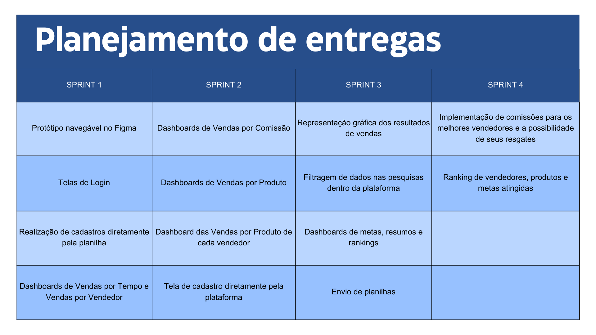

# Sales-Dash

# 🎯 Projeto

 O desafio do terceiro semestre consiste no desenvolvimento de uma  Dashboard de Comissões de Vendas, para uma empresa que receba dados de vendas e apresente as informações de comissões de vendas dos vendedores. O sistema deve ser capaz de calcular e exibir as comissões com base em diferentes tipos de vendas, tais como: 

- Produto novo para novo cliente 

- Produto antigo para cliente novo 

- Produto novo para cliente antigo 

- Produto antigo para cliente antigo 

- Cada tipo de venda estará associado a um plano de remuneração específico, que poderá ser configurado para determinar o bônus a ser atribuído a cada vendedor. 

 Este desafio proposto pela disciplina de Estrutura de Dados e Engenharia de Software na Fatec São José dos Campos, visa levantar e registrar requisitos usando técnicas de métodos ágeis e tradicionais, documentar adequadamente DoR e DoD, modelar processos de negócio usando técnicas VPC e BPMN, planejar desenvolvimento de software (Backlog de Produto e Backlog de Sprint), projetar arquitetura lógica de software, implementar aplicação usando conceitos de orientação a objetos (ORM), utilizar IDE´s na implementação de aplicação em Typescript

# ➯ Cronograma

## 👨‍💻 Equipe

  
|Nome|Função|GitHub|Linkedin|
| -------- |-------- |-------- |-------- |
|**Bruno Silvério**|Scrum Master|[@GitHub](https://github.com/BrunoVieira30)|[@Linkedin](https://www.linkedin.com/in/bruno-vieira-b999a2224/)
|**Cauã Dezidera**|Product Owner|[@GitHub](https://github.com/CauaDezidera)|[@Linkedin](https://www.linkedin.com/in/cauã-dezidera-375736275/) 
|**Mateus Madeira**|Desenvolvedor|[@GitHub](https://github.com/mafemad)|[@Linkedin](https://www.linkedin.com/in/mateus-ferreira-madeira)
|**Pedro Kajiya**|Desenvolvedor|[@GitHub](https://github.com/kajiyap)|[@Linkedin](https://www.linkedin.com/in/pedro-santos-kajiya-65763b260/)
|**Abner Machado**|Desenvolvedor|[@GitHub](https://github.com/abnerdouglas)|[@Linkedin](https://www.linkedin.com/in/abner-douglas-a70a9b199/)
|**Enzo Pereira**|Desenvolvedor|[@Github](https://github.com/Enzopereira01) | [@Linkedin](https://www.linkedin.com/in/enzo-pereira-13331b272/)
|**Erick Hideki**|Desenvolvedor|[@GitHub](https://github.com/erickhoawata)|[@Linkedin](http://linkedin.com/in/érick-awata)
|**Maria Eduarda Leite**|Desenvolvedor|[@GitHub](https://github.com/Dudaleite08)|[@Linkedin]()
|**Ryan Seiji Wakugawa**|Desenvolvedor|[@GitHub](https://github.com/ryan-wakugawa)|[@Linkedin](https://www.linkedin.com/in/ryan-wakugawa-526bbb27a)
   
  

## ➯ Requisitos funcionais

- Desenvolver uma interface para upload de vendas. 

- Calcular as comissões dos vendedores com base nos diferentes tipos de venda e nos planos de remuneração associados. 

- Desenvolver um dashboard de comissões de vendas que apresente as informações de forma clara e intuitiva. 

- Desenvolvimento de funcionalidades de filtragem e segmentação para os gráficos, permitindo aos usuários explorar os dados de comissões de vendas com mais detalhes. 

- Implementação de gráficos e visualizações de dados para análise de desempenho de vendas. 

## ➯ Requisitos não funcionais

- Documentação API – Application Programming Interface. 

- Modelagem de Banco de Dados ou Arquivo de dados. 

- Garantia de desempenho e escalabilidade do sistema, mesmo com grandes volumes de dados de vendas e usuários simultâneos. 

- Interface responsiva e amigável para facilitar o acesso e a utilização do dashboard em diferentes dispositivos e tamanhos de tela.

## ➯ Tecnologias utilizadas

- NodeJS 

- React

- TypeScript

- PostgreSQL

  
## ➯ Outras Ferramentas utilizadas

  - Excel
  - Trello
  - Figma

<h2>🔗 Link para o protótipo desenvolvido no Figma </h2>
O protótipo no Figma foi desenvolvido para receber a aprovação prévia do cliente e para a vizualização do projeto sem que todo o código tenha que ser baixado. 

<a href="https://www.figma.com/proto/88D1Wws27UWjdCNuZbqEyI/API-3%C2%B0-Sem?type=design&node-id=1-2&t=af4PpE2Z4smTkASO-1&scaling=min-zoom&page-id=0%3A1&starting-point-node-id=1%3A2&mode=design"> Clique aqui para acessar o nosso protótipo </a> 

